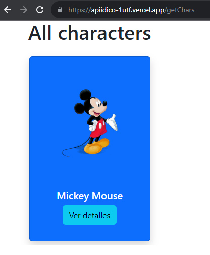
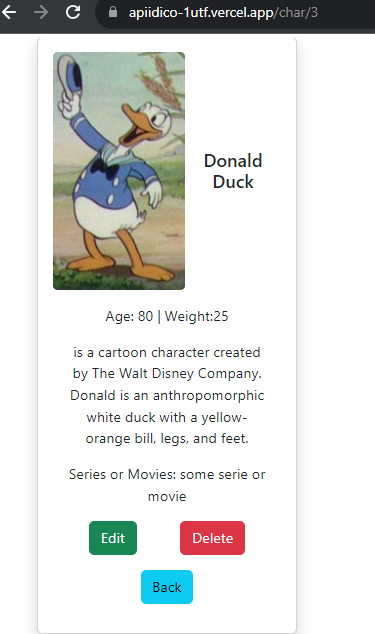

# Idico API - Andres Felipe Salazar Ramos

**Este repositorio es una solución de una prueba técnica para el proceso de selección en Idico**

## Tabla de contenido

- [Resumen](#resumen)
  - [Descripción de la solución](#descripción-de-la-solución)
  - [Organización de las tareas a realizar](#organización-de-tareas)
  - [Links](#links)
  - [Capturas](#capturas-en-el-frontend)
- [Mi Proceso](#my-process)
  - [Tecnologías usadas](#tecnologías-usadas)
  - [Instalación](#instalación)
  - [Algunos snippets](#algunos-snippets)
  - [Mejoras por realizar](#mejoras-por-realizar)
- [Autor](#autor)


## Resumen

### Descripción de la solución

Los usuarios de la api podrán realizar las siguientes tareas:

- Consultar un listado de personajes de Disney
- Editar, eliminar uno de los personajes en la base de datos
- Realizar el registro de usuario, el login y logout
- Los usuarios pueden acceder a un panel de administración si se encuentran logueados


[![Video resumen]](https://youtu.be/cAZEAxWJa4s)

### Organización de tareas

Para el desarrollo de la prueba se consideran las siguientes etapas con un estimado en tiempo:

**Desarrollo en el backend**

- Estructuración inicial del proyecto e instalación de primeras dependencias 15 mins
- Creación de repositorio en github y administración de ramas - 15 mins
- Configuración de base de datos mysql y prueba de primer modelo- 1 hora
- Desarrollo de ruta inicial -10 mins
- Deploy inicial de prueba en render.com con ruta inicial - 10 mins
- Desarrollo de rutas necesarias, controladores, pruebas en thunder - 1 día

**Desarrollo del frontend**

- Estructuración inicial del proyecto e instalación de primeras dependencias 15 mins
- Deploy inicial de prueba en vercel.com -15 mins
- Desarrollo de vistas y componentes necesarios  - 1 día

**Deploy Final**
- El proyecto fue desarrollado e integrado a los deploys respectivos de manera continua, para adelantarse a la entrega final que requería que el backend estuviera en producción y pudiera ser consumido por cualquier aplicación

### Links

- Backend URL (Render): [API Idico](https://myidicoapi.onrender.com/)
- Frontend URL (Vercel): [Client Idico](https://apiidico-1utf.vercel.app/getChars)

### Capturas en el frontend

Vista de la aplicación en el front para consultar todos los personajes
[consulta todos los personajes](https://apiidico-1utf.vercel.app/getChars)


Vista de la aplicación en el front para consultar el detalle de un personaje
[consulta un detalle del personaje](https://apiidico-1utf.vercel.app/char/3)



## Mi proceso

### Tecnologías usadas

- Nodejs
- Express
- [JWT](https://www.npmjs.com/package/jsonwebtoken) - paquete para generar tokens de inicio de sesión
- [bcrypt](https://www.npmjs.com/package/bcryptjs)- paquete para encriptar la contraseña
- Sequelize - Mysql
- React - JS library


### Instalación

Clonar el repositorio, dirigirse a la carpeta **api** y ejecutar
```
npm i
```
Para ejecutar el frontend, dirigirse a la carpeta **client** y ejecutar
```
npm i
```

Para replicar se deben considerar las siguientes variables de entorno

```
DB =
DB_USER =
DB_PASSWORD =
DB_HOST=


CLOUD_DB_USER=
CLOUD_DB_NAME=
CLOUD_DB_PASSWORD=
CLOUD_DB_HOST=


JWT_SECRET =

JWT_EXPIRES_TIME =
COOKIE_EXPIRES_TIME=
```

**Presento algunos snippets relevantes de la API**

Se creo una ruta simulando un futuro panel de administración donde solo podrán accederse si
el usuario está autenticado. Antes de consultar en el panel todos los usuarios se ejecuta la función **isAuthenticatedUser**. Lo anterior implica que la ruta está protegida.
```js
router.route('/admin/users').get(isAuthenticatedUser,allUsers);
```


La siguiente función se encarga de encriptar la contraseña antes de guardarla en la base de datos al momento de registro de un usuario, generando a su vez un token para acceder a la aplicación.
```js
exports.registerUser =async(req, res)=>{

    const { name, email, password } =req.body;

    let passwordHash = await bcrypt.hash(password, 10)

    const user = await Users.create({
        name,
        email,
        password:passwordHash
    })
    sendToken(user, 200, res)
}
```

Se crearon distintos modelos de bases de datos utilizando sequelize y Mysql
```js
module.exports = (sequelize, DataTypes)=>{
    const Char = sequelize.define("char", {
        image:{
            type: DataTypes.STRING,
            allownull: false
        },
        name:{
            type: DataTypes.STRING,
            primaryKey:true,
            allownull:false
        },
        age: {
            type: DataTypes.INTEGER
        },
        weight:{
            type: DataTypes.INTEGER
        },
        history:{
            type:DataTypes.TEXT
        },
        relatedmovieserie:{
            type: DataTypes.STRING
        }


    })

    return Char
}
```


### Mejoras por realizar

- Se quiere trabajar adicionalmente en validaciones para los formularios
- Se quiere trabajar adicionalmente en navegabilidad y uso del frontend


## Autor
**Andrés Salazar**
- Website - [Mi portafolio](https://andresfelipe.dev)
- Linkedin - [Perfil](https://www.linkedin.com/in/felipe-salazar-7b3923220)


